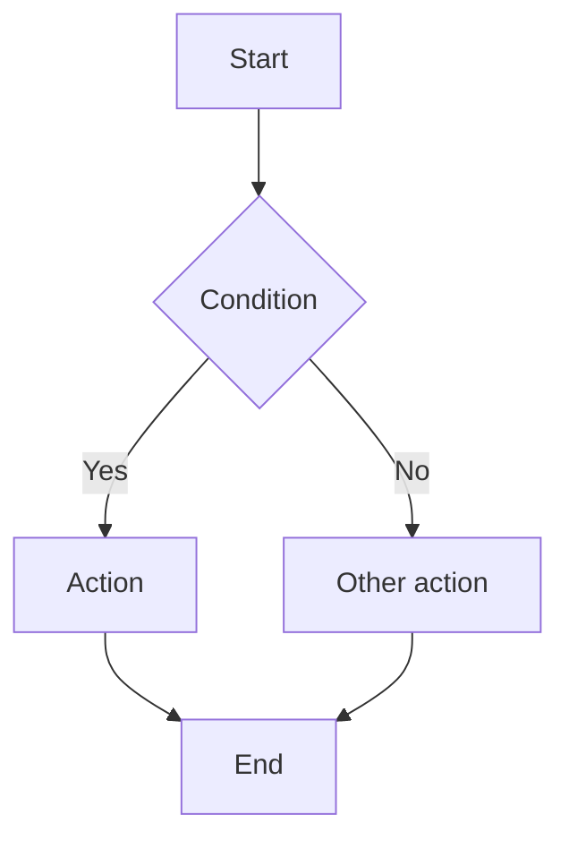

# Master Module Spec

> Copy this file once per module.
> Filename: `spec-[module-name].md` (e.g. `spec-admission-form.md`)
> Everything for this module lives here. Do not split into separate files.

---

## Module Identity

| | |
|---|---|
| **Module name** | |
| **Jira epic / ticket** | |
| **Source** | [ ] Delphi refactor  [ ] Jira ticket  [ ] User story  [ ] My idea |
| **Status** | [ ] Capturing  [ ] Field mapping  [ ] Designing  [ ] Prototyping  [ ] UX review  [ ] Dev-ready |
| **Owner** | |
| **Last updated** | |

---

## Section 1 — Problem Statement

> One paragraph. What is broken or missing, who is affected, what would be better.
> If starting from a Delphi module: what did the old module do and why is it being replaced.

**Problem:**

**Primary user:** (e.g. Midwife during active labor)

**When they use this:** (e.g. On admission of a new patient)

**What success looks like:** (e.g. Midwife can complete the admission form in under 5 minutes with no paper fallback needed)

**Explicitly out of scope:**

---

## Section 2 — Old Module Analysis (Delphi refactor only)

> Skip this section if you are not refactoring a Delphi module.
> Fill this before Section 3 — it tells you what you are actually replacing.

### Old module overview
What the old Delphi module did, its key screens/forms, how it was used.

### Field delta table

| Old field name | Old label (NO) | Type | Keep / Change / Remove | New label (NO) | Notes |
|---|---|---|---|---|---|
| | | | | | |

**Removed fields — reason:**
(Document why each removed field is being dropped. Important for clinical traceability.)

**New fields — reason:**
(Document why each new field is being added.)

### Data structure changes
List any database or API changes implied by the field delta.

### Known issues with the old module
(What complaints have you or users had about it?)

---

## Section 3 — Functional Spec

> What the module does. Written for a developer who has never seen it.
> Update this section whenever scope changes — add `[updated: dd.mm.yyyy]` after changed paragraphs.

### Overview
(2-4 sentences)

### User flows

**Flow 1: [name]**
```
1. User opens [screen]
2. User [action]
3. System [response]
4. ...
5. End state: [what the user has achieved]
```

**Flow 2: [name]**
```
...
```

### Business rules
> Rules the system must enforce, beyond form validation.

| # | Rule | Trigger | Action |
|---|---|---|---|
| 1 | | | |

### Permissions

| Role | View | Create | Edit | Delete | Notes |
|---|---|---|---|---|---|
| Midwife | ✓ | ✓ | ✓ | | |
| Doctor | ✓ | ✓ | ✓ | | |
| Secretary | ✓ | | | | |
| Read-only | ✓ | | | | |

---

## Section 4 — Field Map & Validation

> Fill this BEFORE opening Figma.
> This is your source of truth for the design, the dev build, and the tests.

### Claude prompt to bootstrap this section:
```
I am mapping fields for [module name] in Partus (Norwegian birth journal).
Known fields so far: [list]
Old Delphi module fields (if any): [list]

For each field, give me a table with:
- Norwegian label, English label
- Field type (text/number/date/dropdown/radio/checkbox/calculated/read-only)
- Required (yes/no/conditional)
- Dropdown options if applicable (Norwegian labels + short codes)
- Validation rules (required, min/max, clinical range, regex)
- Data source: MANUAL / CALC:[formula] / SYNC:[system] / READ-ONLY
- Where it writes to
- Edge cases: null, unknown, refused, not applicable
```

### Field map

| # | Norwegian label | English label | Type | Required | Options / Range | Validation | Source | Notes |
|---|---|---|---|---|---|---|---|---|
| 1 | | | | | | | | |
| 2 | | | | | | | | |
| 3 | | | | | | | | |

### Dropdown options

**[Field name]**
| Code | Norwegian label | Notes |
|---|---|---|
| | | |

**[Field name]**
| Code | Norwegian label | Notes |
|---|---|---|
| | | |

### Clinical validation rules

| Field | Normal range | Warning threshold | Block threshold | Error message (NO) |
|---|---|---|---|---|
| | | | | |

### Empty / edge state handling

| Field | Null/empty | Unknown | Not applicable | Refused by patient |
|---|---|---|---|---|
| | Show "—" | Show "Ukjent" | Hide / Show "Ikke aktuelt" | Show "Ønsker ikke å oppgi" |

---

## Section 5 — Design Decisions & Prototype Log

> Log every significant design decision and every round of customer feedback.
> This is how you maintain overview without managing multiple versions.

### Design decisions

| Date | Decision | Reason | Affects sections |
|---|---|---|---|
| | | | |

### Customer prototype reviews

**Review round 1** — Date:
- Attendees:
- Feedback:
- Changes required: (mark affected sections with `[updated: dd.mm.yyyy]`)
- Status: [ ] Changes made  [ ] Pending

**Review round 2** — Date:
- Attendees:
- Feedback:
- Changes required:
- Status: [ ] Changes made  [ ] Pending

---

## Section 6 — UX Review

> Run this before marking status as "Dev-ready".
> Score each item: ✓ Pass  ✗ Fail  — Not applicable

### Must-pass before handoff (Critical & High)

| # | Check | Score | Note |
|---|---|---|---|
| **Clinical** | | | |
| C1 | Most common task done in ≤3 clicks | | |
| C2 | Critical information visible without scrolling | | |
| C3 | No irreversible action without confirmation dialog | | |
| C4 | Norwegian clinical terminology verified with clinician | | |
| **Accessibility (WCAG 2.1 AA — required for Norwegian health software)** | | | |
| A1 | All text contrast ≥ 4.5:1 | | |
| A2 | All form inputs have visible labels (not only placeholder) | | |
| A3 | All interactive elements reachable by keyboard | | |
| A4 | Error messages are next to the field, not only at top | | |
| A5 | Color is not the only indicator of status | | |
| **Forms** | | | |
| F1 | Required fields clearly marked | | |
| F2 | All dropdown options present and correct in Norwegian | | |
| F3 | Date format dd.mm.yyyy, decimal comma throughout | | |
| F4 | All field states designed: default, error, disabled, read-only | | |
| **Privacy (GDPR / Norm for informasjonssikkerhet)** | | | |
| P1 | Patient-identifiable data not shown unnecessarily | | |
| P2 | Sensitive fields masked where appropriate | | |
| **Design consistency** | | | |
| D1 | All components from Partus library | | |
| D2 | Figma Design Lint: 0 errors | | |

### Issues found

| # | Severity | Description | Fix | Fixed? |
|---|---|---|---|---|
| 1 | Critical / High / Medium / Low | | | |

---

## Section 7 — Dev Tickets

> Slice the spec into tickets here, then copy into Jira.
> Each ticket should be deliverable independently by one dev.

### Claude prompt to generate tickets from this spec:
```
Here is my completed spec for [module name] in Partus: [paste this whole spec]

Slice it into Jira tickets. For each ticket:
1. Title (short, action-oriented)
2. User story: "As a [role], I want to [action] so that [outcome]"
3. Acceptance criteria (bullet list, testable)
4. Technical notes for the dev (Angular 18 patterns, relevant service or component)
5. Story point estimate with brief reasoning (use Fibonacci: 1, 2, 3, 5, 8, 13)
6. Dependencies (must be done before/after which other ticket)

Group tickets by: Frontend UI / API / Data migration / Testing
Flag any ticket larger than 8 points — it should be split.
```

### Ticket table

| # | Title | Type | Story points | Depends on | Status |
|---|---|---|---|---|---|
| T1 | | Frontend / API / Data / Test | | | Backlog |
| T2 | | | | | |

### Story point reference (use this when estimating)

| Points | What it means | Examples |
|---|---|---|
| 1 | Trivial — change text, adjust style, config flag | Rename a label, change a color token |
| 2 | Small — one component, no business logic | Display-only field, static list |
| 3 | Standard — one component with state + validation | Single form field with validation and error state |
| 5 | Medium — multiple components or integration point | Full form section with API read, field map complete |
| 8 | Large — cross-cutting or uncertain | New module with complex business rules, or anything with unclear scope |
| 13 | Too big — split this ticket | |

**Delphi refactor baseline estimates:**
- Simple field type change (text → dropdown with options): 3 pts
- Field removed + data migration: 5 pts
- New field with sync to external system (DIPS, FHIR): 8 pts
- Full form section refactor (5-10 fields): 8 pts
- New module from scratch: split into ≥3 tickets

---

## Section 8 — Test Cases

> Generate from the accepted spec and field map. One test case per meaningful user flow or business rule.

### Claude prompt to generate test cases:
```
Here is the spec for [module name] in Partus: [paste spec sections 3 and 4]

Generate test cases covering:
1. Happy path (complete flow for each user flow)
2. Validation (each required field, each clinical range rule)
3. Edge cases (null values, unknown/refused options, concurrent edits)
4. Role-based access (each permission row in Section 3)
5. Integration (if data syncs to/from external system)

Format each test case as:
- ID: TC-[module]-[number]
- Title
- Preconditions
- Steps
- Expected result
- Test data example
```

### Test cases

**TC-[module]-001: [Happy path title]**
- **Preconditions:** 
- **Steps:**
  1. 
  2. 
- **Expected result:** 
- **Test data:** 

**TC-[module]-002: [Validation title]**
- **Preconditions:** 
- **Steps:**
  1. 
- **Expected result:** 
- **Test data:** 

---

## Section 9 — Workflows

> Text-based workflow diagrams you can paste into Figma/FigJam or convert to Mermaid.

### Claude prompt to generate workflows:
```
Based on this functional spec for [module name]: [paste Section 3]

Draw the main user workflow as a Mermaid flowchart.
Include:
- Entry points (how the user gets to this module)
- Decision points (e.g. does patient have a risk factor?)
- Error paths (validation failures, permission blocks)
- Exit points (save, cancel, navigate away)
Keep it to one page — combine minor steps.
```

### Main workflow



---

## Change Log

> Add a line every time something significant changes in this spec.
> This is your version history — no need for separate files.

| Date | Changed by | What changed | Why |
|---|---|---|---|
| | | | |

---

## Open Questions

> Park questions here until answered. Move answered ones to the Decision Log in Section 5.

| # | Question | Owner | Date asked | Answer |
|---|---|---|---|---|
| 1 | | | | |
